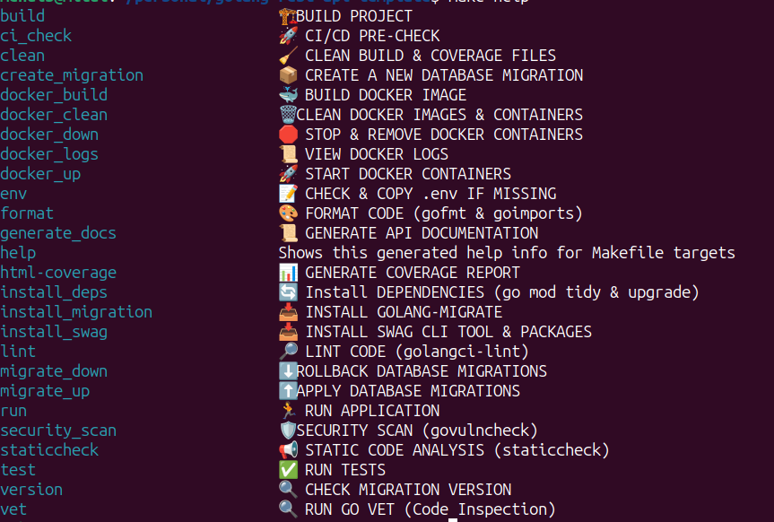

# golang-rest-api-template
[](https://raw.githubusercontent.com/MitulShah1/golang-rest-api-template/main/LICENSE)
[](https://github.com/MitulShah1/golang-rest-api-template/actions/workflows/go.yml)
[](https://codecov.io/github/MitulShah1/golang-rest-api-template)
[](https://goreportcard.com/report/github.com/MitulShah1/golang-rest-api-template)

## Overview
This is a template for building production-ready and easily extendible REST API using Go. It follows best practices and includes a standardized project structure with all necessary components for building scalable microservices.

## Features
- Structured logging
- Middleware support (authentication, etc.)
- Configuration management
- API documentation with Swagger
- Docker support
- CI/CD pipeline with Jenkins
- Database migrations
- End-to-end testing
- Makefile for common operations

The main ones are:

* [gorilla/mux](http://www.gorillatoolkit.org/pkg/mux) for routing
* [go-playground/validator](https://github.com/go-playground/validator) for request validation
* [go-sql-driver/mysql](https://github.com/go-sql-driver/mysql) for MySQL database access
* [jmoiron/sqlx](https://github.com/jmoiron/sqlx) for enhanced database access
* [Masterminds/squirrel](https://github.com/Masterminds/squirrel) for SQL builder
* [golang-migrate/migrate](https://github.com/golang-migrate/migrate) for database migrations
* [swaggo/swag](https://github.com/swaggo/swag) for API documentation generation
* [strechr/testify](https://github.com/stretchr/testify) for writing easier test assertions
* [mockery/](https://vektra.github.io/mockery/) for generating mock interfaces
* [uber/zap](go.uber.org/zap) for structured logging
## Project Structure
```
golang-microservice-template/
│── cmd/
│   ├── server/                # Main entry point for the service
│   │   ├── main.go
│── config/
│   ├── config.go              # Application configuration
│── docs/                      # API documentation
│── internal/
│   ├── handlers/              # HTTP handlers
│   │   ├── server.go          # HTTP server
│   ├── services/              # Business logic
│   ├── repository/            # Data access layer
│── package/                   # Utility packages (database, logging, middleware, etc.)
│   ├── database/
│   │   ├── database.go
│── │   ├──migrations/         # Database migrations
│   ├── logger/
│   │   ├── logger.go
│   ├── middleware/
│   │   ├── basic_auth.go
│   │   ├── cors.go
│── test/
│   ├── e2e/                    # End-to-end tests
│── Dockerfile                  # Docker build configuration
│── docker-compose.yml          # Docker Compose setup
│── Makefile                    # Build automation
│── go.mod                      # Go module dependencies
│── go.sum                      # Dependencies lock file
│── README.md                   # Project documentation
```

## Getting Started

### Prerequisites
- Go 1.21 or higher
- Docker and Docker Compose
- Make

### All Make Commands
To Check All Commands:
```bash
make help
```


### Running the Application
1. Clone the repository
```bash
git clone https://github.com/MitulShah1/golang-rest-api-template.git
```

2. Create .env file from .env.example add details
```bash
make env
```

3. Start the application using Docker Compose
```bash
make docker_up
```

### Development
Build the application:
```bash
make build
```

Run tests:
```bash
make test
```

Generate API documentation:
```bash
make generate_docs
```

### DB Migrations
Create Migration:
```bash
make create_migration
```

Run Migrations:
```bash
make migration_up
```

Down Migrations:
```bash
make migration_down
```

## Configuration
Configuration is managed through `.env`. Environment variables can override these settings.

## API  Documentation
API documentation is generated using Swagger. The documentation is available at `http://localhost:8080/swagger/index.html`.

## Testing
- Unit tests are alongside the code
- Integration tests are in the `test/` directory
- Run all tests with `make test`

## Deployment
The project includes:
- Dockerfile for containerization
- docker-compose.yml for local development
- Jenkinsfile for CI/CD pipeline

## Contributing
1. Fork the repository
2. Create your feature branch
3. Commit your changes
4. Push to the branch
5. Create a new Pull Request

## License
This project is licensed under the MIT License - see the LICENSE file for details


